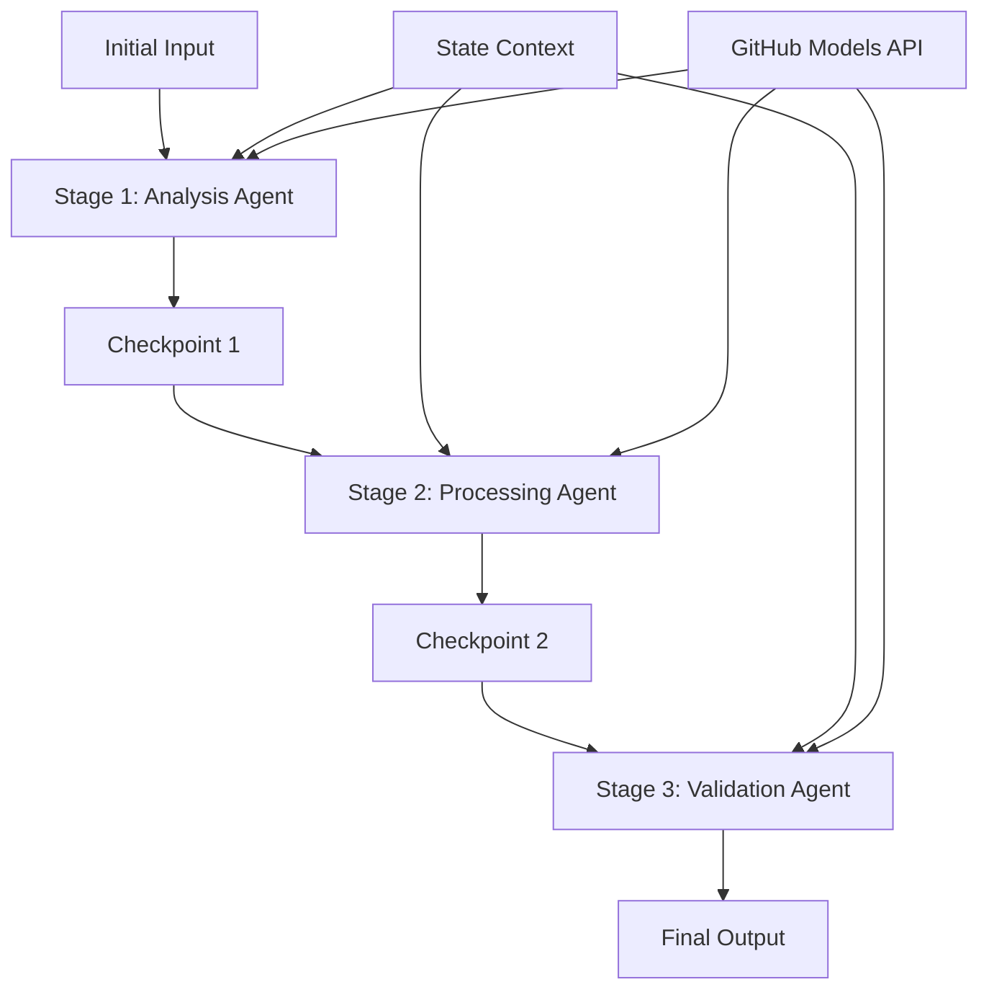

# Notebook: 02.dotnet-agent-framework-workflow-ghmodel-sequential

> Source: https://github.com/microsoft/ai-agents-for-beginners/blob/HEAD/08-multi-agent/code_samples/workflows-agent-framework/dotNET/02.dotnet-agent-framework-workflow-ghmodel-sequential.ipynb

---

# ⏩ Sequential Agent Workflows with GitHub Models (.NET)

## 📋 Advanced Sequential Processing Tutorial

This notebook demonstrates **sequential workflow patterns** using the Microsoft Agent Framework for .NET and GitHub Models. You'll learn how to build sophisticated, step-by-step processing pipelines where agents execute in a specific order, with each stage building upon the results of the previous stage.

## 🎯 Learning Objectives

### 🔄 **Sequential Processing Architecture**
- **Linear Workflow Design**: Create step-by-step processing pipelines with clear dependencies
- **State Management**: Maintain context and data flow across sequential workflow stages
- **GitHub Models Integration**: Leverage GitHub's AI models in multi-stage .NET workflows
- **Enterprise Pipeline Patterns**: Build production-ready sequential processing systems

### 🏗️ **Advanced Sequential Patterns**
- **Stage-Gate Processing**: Implement validation checkpoints between workflow stages
- **Context Preservation**: Maintain state and accumulated knowledge across all stages
- **Error Propagation**: Handle failures gracefully in sequential processing chains
- **Performance Optimization**: Efficient sequential execution with minimal overhead

### 🏢 **Enterprise Sequential Applications**
- **Document Processing Pipeline**: Multi-stage document analysis, transformation, and validation
- **Quality Assurance Workflows**: Sequential review, validation, and approval processes
- **Content Production Pipeline**: Research → Writing → Editing → Review → Publishing
- **Business Process Automation**: Multi-step business workflows with clear stage dependencies

## ⚙️ Prerequisites & Setup

### 📦 **Required NuGet Packages**

Essential packages for .NET sequential workflows:

```xml
<!-- Core AI Framework -->
<PackageReference Include="Microsoft.Extensions.AI" Version="9.9.0" />

<!-- Client Model Abstractions -->
<PackageReference Include="System.ClientModel" Version="1.6.1.0" />

<!-- Azure Identity and Async LINQ Support -->
<PackageReference Include="Azure.Identity" Version="1.15.0" />
<PackageReference Include="System.Linq.Async" Version="6.0.3" />

<!-- Local Agent Framework References -->
<!-- Microsoft.Agents.AI.dll - Core agent abstractions -->
<!-- Microsoft.Agents.AI.OpenAI.dll - GitHub Models integration -->
```

### 🔑 **GitHub Models Configuration**

**Environment Setup (.env file):**
```env
GITHUB_TOKEN=your_github_personal_access_token
GITHUB_ENDPOINT=https://models.inference.ai.azure.com
GITHUB_MODEL_ID=gpt-4o-mini
```

**Configuration Management:**
```csharp
// Load environment variables securely
Env.Load("../../../.env");
var githubToken = Environment.GetEnvironmentVariable("GITHUB_TOKEN");
var githubEndpoint = Environment.GetEnvironmentVariable("GITHUB_ENDPOINT");
var modelId = Environment.GetEnvironmentVariable("GITHUB_MODEL_ID");
```

### 🏗️ **Sequential Workflow Architecture**



**Key Components:**
- **Sequential Agents**: Specialized agents for each processing stage
- **State Context**: Maintains accumulated data and decisions across stages
- **Checkpoints**: Validation points between stages to ensure quality and consistency
- **GitHub Models Client**: Consistent AI model access across all workflow stages

## 🎨 **Sequential Workflow Design Patterns**

### 📝 **Document Processing Pipeline**
```
Raw Document → Content Extraction → Analysis → Validation → Structured Output
```

### 🎯 **Content Creation Workflow**
```
Brief/Requirements → Research → Content Creation → Review → Final Polish
```

### 🔍 **Quality Assurance Pipeline**
```
Initial Review → Technical Validation → Compliance Check → Final Approval
```

### 💼 **Business Intelligence Workflow**
```
Data Collection → Processing → Analysis → Report Generation → Distribution
```

## 🏢 **Enterprise Sequential Benefits**

### 🎯 **Reliability & Quality**
- **Deterministic Processing**: Consistent, repeatable outcomes through structured stages
- **Quality Gates**: Validation checkpoints ensure quality at each stage
- **Error Isolation**: Problems in one stage don't propagate to subsequent stages
- **Audit Trails**: Complete tracking of decisions and transformations at each stage

### 📈 **Scalability & Performance**
- **Modular Design**: Each stage can be optimized independently
- **Resource Management**: Efficient allocation of AI model resources across stages
- **State Optimization**: Minimal state transfer between stages for optimal performance
- **Parallel Stage Groups**: Multiple sequential workflows can run in parallel

### 🔒 **Security & Compliance**
- **Stage-Level Security**: Different security policies for different processing stages
- **Data Validation**: Ensure data integrity and compliance at each checkpoint
- **Access Control**: Granular permissions for different workflow stages
- **Regulatory Compliance**: Meet regulatory requirements through structured processing

### 📊 **Monitoring & Analytics**
- **Stage-Level Metrics**: Performance monitoring for each workflow stage
- **Bottleneck Identification**: Identify and optimize slow stages
- **Quality Metrics**: Track quality and success rates at each stage
- **Process Optimization**: Continuous improvement based on stage-level analytics

Let's build robust sequential AI processing pipelines! 🚀

```python
#r "nuget: Microsoft.Extensions.AI, 9.9.1"
```

```python
#r "nuget: System.ClientModel, 1.6.1.0"
```

```python
#r "nuget: Azure.Identity, 1.15.0"
#r "nuget: System.Linq.Async, 6.0.3"
#r "nuget: OpenTelemetry.Api, 1.0.0"
```

```python
#r "nuget: Microsoft.Agents.AI.Workflows, 1.0.0-preview.251001.3"
```

```python
#r "nuget: Microsoft.Agents.AI.OpenAI, 1.0.0-preview.251001.3"
```

```python
#r "nuget: DotNetEnv, 3.1.1"
```

```python
// #r "nuget: Microsoft.Extensions.AI.OpenAI, 9.9.0-preview.1.25458.4"
```

```python
using System;
using System.ComponentModel;
using System.ClientModel;
using OpenAI;
using Azure.Identity;
using Microsoft.Extensions.AI;
using Microsoft.Agents.AI;
using Microsoft.Agents.AI.Workflows;
```

```python
 using DotNetEnv;
```

```python
Env.Load("../../../.env");
```

```python

var github_endpoint = Environment.GetEnvironmentVariable("GITHUB_ENDPOINT") ?? throw new InvalidOperationException("GITHUB_ENDPOINT is not set.");
var github_model_id =  "gpt-4o";
var github_token = Environment.GetEnvironmentVariable("GITHUB_TOKEN") ?? throw new InvalidOperationException("GITHUB_TOKEN is not set.");

var imgPath ="../imgs/home.png";
```

```python
var openAIOptions = new OpenAIClientOptions()
{
    Endpoint = new Uri(github_endpoint)
};
```

```python

var openAIClient = new OpenAIClient(new ApiKeyCredential(github_token), openAIOptions);
```

```python
const string SalesAgentName = "Sales-Agent";
const string SalesAgentInstructions = "You are my furniture sales consultant, you can find different furniture elements from the pictures and give me a purchase suggestion";
```

```python
const string PriceAgentName = "Price-Agent";
const string PriceAgentInstructions = @"You are a furniture pricing specialist and budget consultant. Your responsibilities include:
        1. Analyze furniture items and provide realistic price ranges based on quality, brand, and market standards
        2. Break down pricing by individual furniture pieces
        3. Provide budget-friendly alternatives and premium options
        4. Consider different price tiers (budget, mid-range, premium)
        5. Include estimated total costs for room setups
        6. Suggest where to find the best deals and shopping recommendations
        7. Factor in additional costs like delivery, assembly, and accessories
        8. Provide seasonal pricing insights and best times to buy
        Always format your response with clear price breakdowns and explanations for the pricing rationale.";
```

```python
const string QuoteAgentName = "Quote-Agent";
const string QuoteAgentInstructions = @"You are a assistant that create a quote for furniture purchase.
        1. Create a well-structured quote document that includes:
        2. A title page with the document title, date, and client name
        3. An introduction summarizing the purpose of the document
        4. A summary section with total estimated costs and recommendations
        5. Use clear headings, bullet points, and tables for easy readability
        6. All quotes are presented in markdown form";
```

```python
using System.IO;

async Task<byte[]> OpenImageBytesAsync(string path)
{
	return await File.ReadAllBytesAsync(path);
}

var imageBytes = await OpenImageBytesAsync(imgPath);
```

```python
imageBytes
```

```python
AIAgent salesagent = openAIClient.GetChatClient(github_model_id).CreateAIAgent(
    name:SalesAgentName,instructions:SalesAgentInstructions);
AIAgent priceagent  = openAIClient.GetChatClient(github_model_id).CreateAIAgent(
    name:PriceAgentName,instructions:PriceAgentInstructions);
AIAgent quoteagent = openAIClient.GetChatClient(github_model_id).CreateAIAgent(
    name:QuoteAgentName,instructions:QuoteAgentInstructions);
```

```python
var workflow = new WorkflowBuilder(salesagent)
            .AddEdge(salesagent,priceagent)
            .AddEdge(priceagent, quoteagent)
            .Build();
```

```python
ChatMessage userMessage = new ChatMessage(ChatRole.User, [
	new DataContent(imageBytes, "image/png"),new TextContent("Please find the relevant furniture according to the image and give the corresponding price for each piece of furniture.Finally Output generates a quotation") 
]);
```

```python
StreamingRun run = await InProcessExecution.StreamAsync(workflow, userMessage);
```

```python
await run.TrySendMessageAsync(new TurnToken(emitEvents: true));
string id="";
string messageData="";
await foreach (WorkflowEvent evt in run.WatchStreamAsync().ConfigureAwait(false))
{
    if (evt is AgentRunUpdateEvent executorComplete)
    {
        if(id=="")
        {
            id=executorComplete.ExecutorId;
        }
        if(id==executorComplete.ExecutorId)
        {
            messageData+=executorComplete.Data.ToString();
        }
        else
        {
            id=executorComplete.ExecutorId;
        }
        // Console.WriteLine($"{executorComplete.ExecutorId}: {executorComplete.Data}");
    }
}

Console.WriteLine(messageData);
```