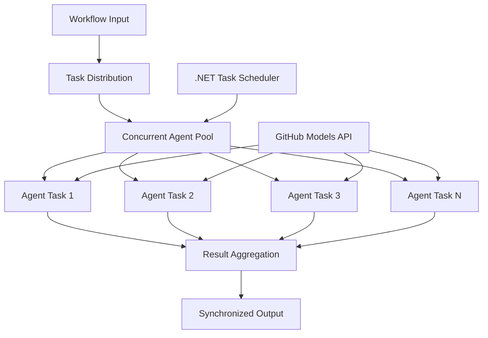

# Notebook: 03.dotnet-agent-framework-workflow-ghmodel-concurrent

> Source: https://github.com/microsoft/ai-agents-for-beginners/blob/HEAD/08-multi-agent/code_samples/workflows-agent-framework/dotNET/03.dotnet-agent-framework-workflow-ghmodel-concurrent.ipynb

---

# ⚡ Concurrent Agent Workflows with GitHub Models (.NET)

## 📋 High-Performance Parallel Processing Tutorial

This notebook demonstrates **concurrent workflow patterns** using the Microsoft Agent Framework for .NET and GitHub Models. You'll learn how to build high-performance, parallel processing workflows that maximize throughput by executing multiple AI agents simultaneously while maintaining coordination and data consistency.

## 🎯 Learning Objectives

### 🚀 **Concurrent Processing Fundamentals**
- **Parallel Agent Execution**: Run multiple AI agents simultaneously for maximum performance
- **Async/Await Patterns**: Leverage .NET's async programming model for efficient concurrency
- **GitHub Models Integration**: Coordinate multiple concurrent calls to GitHub's AI model inference service
- **Resource Management**: Efficiently manage AI model resources across concurrent operations

### 🏗️ **Advanced Concurrency Architecture**
- **Task-Based Parallelism**: Use .NET Task Parallel Library for optimal concurrent execution
- **Synchronization Patterns**: Coordinate concurrent agents while avoiding race conditions
- **Load Balancing**: Distribute work efficiently across available concurrent processing capacity
- **Fault Tolerance**: Handle individual agent failures without stopping the entire workflow

### 🏢 **Enterprise Concurrent Applications**
- **High-Volume Document Processing**: Process multiple documents simultaneously
- **Real-Time Content Analysis**: Concurrent analysis of incoming data streams
- **Batch Processing Optimization**: Maximize throughput for large-scale data processing operations
- **Multi-Modal Analysis**: Parallel processing of different content types and formats

## ⚙️ Prerequisites & Setup

### 📦 **Required NuGet Packages**

Essential packages for high-performance concurrent workflows:

```xml
<!-- Core AI Framework with Async Support -->
<PackageReference Include="Microsoft.Extensions.AI" Version="9.9.0" />

<!-- Client Model Abstractions for API Communication -->
<PackageReference Include="System.ClientModel" Version="1.6.1.0" />

<!-- Azure Identity and Async LINQ for Advanced Operations -->
<PackageReference Include="Azure.Identity" Version="1.15.0" />
<PackageReference Include="System.Linq.Async" Version="6.0.3" />

<!-- Local Agent Framework References -->
<!-- Microsoft.Agents.AI.dll - Core agent abstractions with async support -->
<!-- Microsoft.Agents.AI.OpenAI.dll - GitHub Models integration with concurrency -->
```

### 🔑 **GitHub Models Configuration**

**Environment Setup (.env file):**
```env
GITHUB_TOKEN=your_github_personal_access_token
GITHUB_ENDPOINT=https://models.inference.ai.azure.com
GITHUB_MODEL_ID=gpt-4o-mini
```

**Concurrent Processing Considerations:**
```csharp
// Configure for concurrent operations
var clientOptions = new OpenAIClientOptions()
{
    Endpoint = new Uri(githubEndpoint),
    // Configure connection pooling for concurrent requests
    NetworkTimeout = TimeSpan.FromMinutes(5)
};
```

### 🏗️ **Concurrent Workflow Architecture**



**Key Components:**
- **Task Parallel Library**: .NET's built-in support for concurrent operations
- **Agent Pool**: Multiple agent instances for parallel processing
- **Result Aggregation**: Coordination and merging of concurrent agent results
- **Synchronization Points**: Ensure data consistency across concurrent operations

## 🎨 **Concurrent Workflow Design Patterns**

### 🔍 **Parallel Research & Analysis**
```
Research Topic → Concurrent Research Agents → Result Synthesis → Final Report
```

### 📊 **Multi-Source Data Processing**
```
Data Sources → Parallel Processing Agents → Data Integration → Unified Output
```

### 🎭 **Content Generation Pipeline**
```
Content Requirements → Concurrent Content Generators → Quality Review → Final Content
```

### 🔄 **Fan-Out/Fan-In Processing**
```
Single Input → Multiple Concurrent Processors → Result Aggregation → Single Output
```

## 🏢 **Enterprise Performance Benefits**

### ⚡ **Throughput & Scalability**
- **Linear Performance Scaling**: Add more concurrent agents to increase throughput
- **Resource Utilization**: Maximum efficiency of available AI model capacity
- **Reduced Processing Time**: Significant time reduction through parallel execution
- **Elastic Scaling**: Dynamically adjust concurrent agent count based on workload

### 🛡️ **Reliability & Resilience**
- **Fault Isolation**: Individual agent failures don't affect other concurrent operations
- **Graceful Degradation**: System continues operating with reduced agent capacity
- **Error Recovery**: Automatic retry mechanisms for failed concurrent operations
- **Load Distribution**: Even distribution of work across available agents

### 📊 **Performance Monitoring**
- **Concurrent Execution Metrics**: Track performance of all parallel operations
- **Resource Usage Analytics**: Monitor CPU, memory, and network utilization
- **Throughput Analysis**: Measure efficiency gains from concurrent processing
- **Bottleneck Detection**: Identify and resolve performance constraints

### 🔧 **Development & Operations**
- **Async Programming Model**: Leverage .NET's mature async/await patterns
- **Task Coordination**: Built-in task management and coordination capabilities
- **Exception Handling**: Comprehensive error handling for concurrent operations
- **Debugging Support**: Visual Studio debugging tools for concurrent workflows

Let's build high-performance concurrent AI workflows with .NET! 🚀

```python
#r "nuget: Microsoft.Extensions.AI, 9.9.1"
```

```python
#r "nuget: System.ClientModel, 1.6.1.0"
```

```python
#r "nuget: Azure.Identity, 1.15.0"
#r "nuget: System.Linq.Async, 6.0.3"
#r "nuget: OpenTelemetry.Api, 1.0.0"
```

```python
#r "nuget: Microsoft.Agents.AI.Workflows, 1.0.0-preview.251001.3"
```

```python
#r "nuget: Microsoft.Agents.AI.OpenAI, 1.0.0-preview.251001.3"
```

```python
#r "nuget: DotNetEnv, 3.1.1"
```

```python
// #r "nuget: Microsoft.Extensions.AI.OpenAI, 9.9.0-preview.1.25458.4"
```

```python
using System;
using System.ComponentModel;
using System.ClientModel;
using OpenAI;
using Azure.Identity;
using Microsoft.Extensions.AI;
using Microsoft.Agents.AI;
using Microsoft.Agents.AI.Workflows;
using Microsoft.Agents.AI.Workflows.Reflection;
```

```python
 using DotNetEnv;
```

```python
Env.Load("../../../.env");
```

```python

var github_endpoint = Environment.GetEnvironmentVariable("GITHUB_ENDPOINT") ?? throw new InvalidOperationException("GITHUB_ENDPOINT is not set.");
var github_model_id =  "gpt-4o";
var github_token = Environment.GetEnvironmentVariable("GITHUB_TOKEN") ?? throw new InvalidOperationException("GITHUB_TOKEN is not set.");

```

```python
var openAIOptions = new OpenAIClientOptions()
{
    Endpoint = new Uri(github_endpoint)
};
```

```python
var openAIClient = new OpenAIClient(new ApiKeyCredential(github_token), openAIOptions);
```

```python
const string ResearcherAgentName = "Researcher-Agent";
const string ResearcherAgentInstructions = "You are my travel researcher, working with me to analyze the destination, list relevant attractions, and make detailed plans for each attraction.";
```

```python
const string PlanAgentName = "Plan-Agent";
const string PlanAgentInstructions = "You are my travel planner, working with me to create a detailed travel plan based on the researcher's findings.";
```

```python
AIAgent researcherAgent = openAIClient.GetChatClient(github_model_id).CreateAIAgent(
    name:ResearcherAgentName,instructions:ResearcherAgentInstructions);
AIAgent plannerAgent  = openAIClient.GetChatClient(github_model_id).CreateAIAgent(
    name:PlanAgentName,instructions:PlanAgentInstructions);
```

```python

public class ConcurrentStartExecutor() :
    ReflectingExecutor<ConcurrentStartExecutor>("ConcurrentStartExecutor"),
    IMessageHandler<string>
{
    /// <summary>
    /// Starts the concurrent processing by sending messages to the agents.
    /// </summary>
    /// <param name="message">The user message to process</param>
    /// <param name="context">Workflow context for accessing workflow services and adding events</param>
    /// <returns>A task representing the asynchronous operation</returns>
    public async ValueTask HandleAsync(string message, IWorkflowContext context)
    {
        // Broadcast the message to all connected agents. Receiving agents will queue
        // the message but will not start processing until they receive a turn token.
        await context.SendMessageAsync(new ChatMessage(ChatRole.User, message));
        // Broadcast the turn token to kick off the agents.
        await context.SendMessageAsync(new TurnToken(emitEvents: true));
    }
}

/// <summary>
/// Executor that aggregates the results from the concurrent agents.
/// </summary>
public class ConcurrentAggregationExecutor() :
    ReflectingExecutor<ConcurrentAggregationExecutor>("ConcurrentAggregationExecutor"),
    IMessageHandler<ChatMessage>
{
    private readonly List<ChatMessage> _messages = [];

    /// <summary>
    /// Handles incoming messages from the agents and aggregates their responses.
    /// </summary>
    /// <param name="message">The message from the agent</param>
    /// <param name="context">Workflow context for accessing workflow services and adding events</param>
    /// <returns>A task representing the asynchronous operation</returns>
    public async ValueTask HandleAsync(ChatMessage message, IWorkflowContext context)
    {
        this._messages.Add(message);

        if (this._messages.Count == 2)
        {
            var formattedMessages = string.Join(Environment.NewLine, this._messages.Select(m => $"{m.AuthorName}: {m.Text}"));
            await context.YieldOutputAsync(formattedMessages);
        }
    }
}
```

```python
var startExecutor = new ConcurrentStartExecutor();
var aggregationExecutor = new ConcurrentAggregationExecutor();
```

```python
var workflow = new WorkflowBuilder(startExecutor)
            .AddFanOutEdge(startExecutor, targets: [researcherAgent, plannerAgent])
            .AddFanInEdge(aggregationExecutor, sources: [researcherAgent, plannerAgent])
            .WithOutputFrom(aggregationExecutor)
            .Build();
```

```python

        StreamingRun run = await InProcessExecution.StreamAsync(workflow, "Plan a trip to Seattle in December");
        await foreach (WorkflowEvent evt in run.WatchStreamAsync().ConfigureAwait(false))
        {
            if (evt is WorkflowOutputEvent output)
            {
                Console.WriteLine($"Workflow completed with results:\n{output.Data}");
            }
        }
```