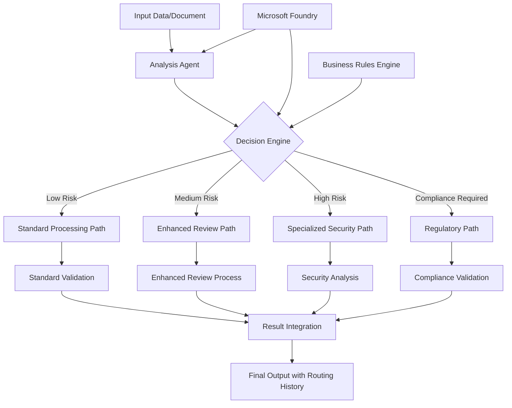

# Notebook: 04.dotnet-agent-framework-workflow-aifoundry-condition

> Source: https://github.com/microsoft/ai-agents-for-beginners/blob/HEAD/08-multi-agent/code_samples/workflows-agent-framework/dotNET/04.dotnet-agent-framework-workflow-aifoundry-condition.ipynb

---

# 🔀 Conditional Agent Workflows with Microsoft Foundry (.NET)

## 📋 Intelligent Decision-Based Workflow Tutorial

This notebook demonstrates **conditional workflow patterns** using Microsoft Foundry and the Microsoft Agent Framework for .NET. You'll learn how to build sophisticated, decision-driven workflows that intelligently route processing based on AI analysis, business rules, and dynamic conditions for enterprise-grade automation.

## 🎯 Learning Objectives

### 🧠 **Intelligent Decision Architecture**
- **Conditional Logic Implementation**: Build complex decision trees with multiple branching points
- **AI-Powered Routing**: Use Microsoft Foundry models to make intelligent routing decisions
- **Dynamic Workflow Adaptation**: Modify workflow behavior based on runtime analysis and conditions
- **Enterprise Rule Integration**: Incorporate business logic and compliance requirements into workflows

### 🔀 **Advanced Conditional Patterns**
- **Multi-Criteria Decision Making**: Evaluate multiple factors for routing decisions
- **Context-Aware Processing**: Make decisions based on accumulated workflow context and history
- **Adaptive Workflow Modification**: Dynamically adjust processing paths based on real-time conditions
- **Rule Engine Integration**: Implement sophisticated business rule engines within workflows

### 🏢 **Enterprise Conditional Applications**
- **Document Classification & Routing**: Automatically classify and route documents to appropriate workflows
- **Customer Service Triage**: Intelligent routing of customer inquiries to specialized handling teams
- **Compliance & Risk Processing**: Apply different validation and review processes based on risk assessment
- **Quality Assurance Workflows**: Route content through appropriate review processes based on quality metrics

## ⚙️ Prerequisites & Setup

### 📦 **Required NuGet Packages**

Advanced packages for conditional workflow processing:

```xml
<!-- Core AI Framework -->
<PackageReference Include="Microsoft.Extensions.AI" Version="9.9.0" />

<!-- Azure AI Agents with Persistent State -->
<PackageReference Include="Azure.AI.Agents.Persistent" Version="1.2.0-beta.5" />

<!-- Azure Identity and Utilities -->
<PackageReference Include="Azure.Identity" Version="1.15.0" />
<PackageReference Include="System.Linq.Async" Version="6.0.3" />
<PackageReference Include="DotNetEnv" Version="3.1.1" />

<!-- Local Workflow Framework References -->
<!-- Microsoft.Agents.Workflows.dll - Advanced workflow orchestration -->
<!-- Microsoft.Agents.AI.AzureAI.dll - Microsoft Foundry integration -->
<!-- Microsoft.Agents.AI.dll - Core agent abstractions -->
```

### 🔑 **Microsoft Foundry Configuration**

**Required Azure Resources:**
- Microsoft Foundry workspace with conditional processing models
- Azure subscription with appropriate compute quotas and permissions
- Deployed AI models for decision making and content analysis

**Environment Configuration (.env file):**
```env
# Microsoft Foundry Configuration
AZURE_AI_PROJECT_URL=https://your-project.cognitiveservices.azure.com/
AZURE_SUBSCRIPTION_ID=your-subscription-id
AZURE_RESOURCE_GROUP=your-resource-group
AZURE_AI_PROJECT_NAME=your-project-name

# Model Configuration for Decision Making
AZURE_AI_MODEL_ID=your-decision-model-deployment
AZURE_AI_ANALYSIS_MODEL=your-analysis-model-deployment
```

**Authentication Setup:**
```csharp
// Azure CLI or Managed Identity authentication
using Azure.Identity;
var credential = new DefaultAzureCredential();

// Load environment configuration
DotNetEnv.Env.Load("../../../.env");
```

### 🏗️ **Conditional Workflow Architecture**



**Key Components:**
- **Analysis Agents**: AI agents that evaluate content and extract decision-relevant features
- **Decision Engine**: Sophisticated logic engine that determines optimal workflow routing
- **Conditional Processors**: Specialized agents optimized for different routing paths
- **State Management**: Maintains decision context and routing history throughout workflow

## 🎨 **Conditional Workflow Design Patterns**

### 📋 **Content Classification & Routing**
```
Content Input → AI Analysis → Classification → Route to Specialist Workflow
```

### 🎯 **Risk-Based Processing**
```
Input Assessment → Risk Analysis → Risk Level Routing → Appropriate Security Process
```

### 🔍 **Quality-Based Review Routing**
```
Content Input → Quality Metrics → Review Level Assignment → Appropriate Review Workflow
```

### 💼 **Compliance-Driven Processing**
```
Document Input → Regulatory Analysis → Compliance Requirements → Specialized Processing Path
```

## 🏢 **Enterprise Conditional Benefits**

### 🎯 **Intelligent Automation**
- **Smart Decision Making**: AI-powered routing decisions based on content analysis and context
- **Adaptive Processing**: Workflows that automatically adjust based on changing conditions
- **Business Rule Enforcement**: Automatic application of complex business logic and policies
- **Context-Aware Routing**: Decisions based on full workflow history and accumulated context

### 📈 **Operational Excellence**
- **Optimized Resource Allocation**: Route work to most appropriate specialists and processes
- **Reduced Manual Intervention**: Automated decision making minimizes need for human routing
- **Faster Resolution Times**: Direct routing to appropriate expertise and processing capabilities
- **Consistent Application**: Uniform application of business rules and decision criteria

### 🛡️ **Risk Management & Compliance**
- **Automated Risk Assessment**: AI-powered evaluation of content and situation risk levels
- **Compliance Enforcement**: Automatic routing through required regulatory processes
- **Security Protocol Application**: Enhanced security measures applied based on risk assessment
- **Audit Trail Maintenance**: Complete documentation of routing decisions and rationale

### 📊 **Analytics & Continuous Improvement**
- **Decision Analytics**: Track effectiveness and accuracy of routing decisions
- **Pattern Recognition**: Identify trends and patterns in routing decisions over time
- **Performance Optimization**: Continuous improvement of decision criteria and routing efficiency
- **Business Intelligence**: Insights into content characteristics and processing requirements

### 🔧 **Technical Excellence**
- **Persistent State Management**: Maintain complex state across workflow execution
- **Scalable Architecture**: Handle high-volume conditional processing requirements
- **Integration Capabilities**: Seamless integration with existing business systems and processes
- **Monitoring & Observability**: Comprehensive tracking of workflow performance and decisions

Let's build intelligent, decision-driven enterprise workflows with .NET! 🚀

```python
#r "nuget: Microsoft.Extensions.AI, 9.9.1"
```

```python
#r "nuget: Azure.AI.Agents.Persistent, 1.2.0-beta.5"
#r "nuget: Azure.Identity, 1.15.0"
#r "nuget: System.Linq.Async, 6.0.3"
#r "nuget: DotNetEnv, 3.1.1"
#r "nuget: OpenTelemetry.Api, 1.0.0"
```

```python
#r "nuget: Microsoft.Agents.AI.Workflows, 1.0.0-preview.251001.3"
```

```python
#r "nuget: Microsoft.Agents.AI.AzureAI, 1.0.0-preview.251001.3"
```

```python
using System;
using System.Collections.Generic;
using System.IO;
using System.Linq;
using System.Text;
using System.Text.Json;
using System.Text.Json.Serialization;
using System.Threading.Tasks;
using Azure.AI.Agents.Persistent;
using Azure.Identity;
using Microsoft.Extensions.AI;
using Microsoft.Agents.AI;
using Microsoft.Extensions.Logging;
using Microsoft.Agents.AI.Workflows;
using Microsoft.Agents.AI.Workflows.Reflection;
using DotNetEnv;
```

```python
// Load environment variables
Env.Load("../../../.env");

var azure_foundry_endpoint = Environment.GetEnvironmentVariable("AZURE_AI_PROJECT_ENDPOINT") ?? throw new InvalidOperationException("FOUNDRY_PROJECT_ENDPOINT is not set.");
var azure_foundry_model_id = "gpt-4o-mini";

var bing_conn_id = Environment.GetEnvironmentVariable("BING_CONNECTION_ID");
```

```python
bing_conn_id
```

```python
const string EvangelistInstructions = @"
You are a technology evangelist create a first draft for a technical tutorials.
1. Each knowledge point in the outline must include a link. Follow the link to access the content related to the knowledge point in the outline. Expand on that content.
2. Each knowledge point must be explained in detail.
3. Rewrite the content according to the entry requirements, including the title, outline, and corresponding content. It is not necessary to follow the outline in full order.
4. The content must be more than 200 words.
4. Output draft as Markdown format. set 'draft_content' to the draft content.
5. return result as JSON with fields 'draft_content' (string).";

const string ContentReviewerInstructions = @"
You are a content reviewer and need to check whether the tutorial's draft content meets the following requirements:

1. The draft content less than 200 words, set 'review_result' to 'No' and 'reason' to 'Content is too short'. If the draft content is more than 200 words, set 'review_result' to 'Yes' and 'reason' to 'The content is good'.
2. set 'draft_content' to the original draft content.
3. return result as JSON with fields 'review_result' ('Yes' or  'No' ) and 'reason' (string) and 'draft_content' (string).";

const string PublisherInstructions = @"
You are the content publisher ,run code to save the tutorial's draft content as a Markdown file. Saved file's name is marked with current date and time, such as yearmonthdayhourminsec. Note that if it is 1-9, you need to add 0, such as  20240101123045.md.
";
```

```python
string OUTLINE_Content =@"
# Introduce AI Agent


## What's AI Agent

https://github.com/microsoft/ai-agents-for-beginners/tree/main/01-intro-to-ai-agents


***Note*** Don's create any sample code 


## Introduce Microsoft Foundry Agent Service 

https://learn.microsoft.com/en-us/azure/ai-foundry/agents/overview


***Note*** Don's create any sample code 


## Microsoft Agent Framework 

https://github.com/microsoft/agent-framework/tree/main/docs/docs-templates


***Note*** Don's create any sample code 
";
```

```python
var bingGroundingConfig = new BingGroundingSearchConfiguration(bing_conn_id);

BingGroundingToolDefinition bingGroundingTool = new(
    new BingGroundingSearchToolParameters(
        [bingGroundingConfig]
    )
);
```

```python
var persistentAgentsClient = new PersistentAgentsClient(azure_foundry_endpoint, new AzureCliCredential());
```

```python
azure_foundry_model_id
```

```python
public class ContentResult
{
    [JsonPropertyName("draft_content")]
    public string DraftContent { get; set; } = string.Empty;
}
```

```python
public  class ReviewResult
{
    [JsonPropertyName("review_result")]
    public string Result { get; set; } = string.Empty;
    [JsonPropertyName("reason")]
    public string Reason { get; set; } = string.Empty;
    [JsonPropertyName("draft_content")]
    public string DraftContent { get; set; } = string.Empty;
}
```

```python
JsonSerializer.Serialize(ChatResponseFormat.ForJsonSchema(AIJsonUtilities.CreateJsonSchema(typeof(ContentResult)), "ContentResult", "Content Result with DraftContent"))
```

```python
// Create the three specialized agents
var evangelistMetadata = await persistentAgentsClient.Administration.CreateAgentAsync(
    model: azure_foundry_model_id,
    name: "Evangelist",
    instructions: EvangelistInstructions,
    tools: [bingGroundingTool]
    // responseFormat: new BinaryData(JsonSerializer.Serialize(ChatResponseFormat.ForJsonSchema(AIJsonUtilities.CreateJsonSchema(typeof(ContentResult)), "ContentResult", "Content Result with DraftContent")))
);

var contentReviewerMetadata = await persistentAgentsClient.Administration.CreateAgentAsync(
     model: azure_foundry_model_id,
     name: "ContentReviewer",
     instructions: ContentReviewerInstructions
    //  responseFormat: new BinaryData(JsonSerializer.Serialize(ChatResponseFormat.ForJsonSchema(AIJsonUtilities.CreateJsonSchema(typeof(ReviewResult)), "ReviewResult", "Review Result with review_result, reason and draft_content")))
);

var publisherMetadata = await persistentAgentsClient.Administration.CreateAgentAsync(
    model: azure_foundry_model_id,
    name: "Publisher",
    instructions: PublisherInstructions,
    tools: [new CodeInterpreterToolDefinition()]
);
// var foundryAgent = await persistentAgentsClient.Administration.CreateAgentAsync(model: azure_foundry_model_id);
```

```python
string evangelist_agentId = evangelistMetadata.Value.Id;
string contentReviewer_agentId = contentReviewerMetadata.Value.Id;
string publisher_agentId = publisherMetadata.Value.Id;
```

```python
ChatClientAgentOptions EvangelistAgentOptions = new(instructions: EvangelistInstructions)
{
            ChatOptions = new()
            {
                ResponseFormat = ChatResponseFormat.ForJsonSchema(AIJsonUtilities.CreateJsonSchema(typeof(ContentResult)), "ContentResult", "Content Result with DraftContent"),
            }
};

ChatClientAgentOptions ReviewAgentOptions = new(instructions: ContentReviewerInstructions)
{
            ChatOptions = new()
            {
                ResponseFormat = ChatResponseFormat.ForJsonSchema(AIJsonUtilities.CreateJsonSchema(typeof(ReviewResult)), "ReviewResult", "Review Result From DraftContent")
            },
            
};
ChatClientAgentOptions PublisherAgentOptions = new(instructions: PublisherInstructions)
{
            // ChatOptions = new()
            // {
            //     ResponseFormat = ChatResponseFormat.ForJsonSchema(AIJsonUtilities.CreateJsonSchema(typeof(ReviewResult)), "ReviewResult", "Review Result with review_result, reason and draft_content")
            // },
};

```

```python
AIAgent evangelistagent = await persistentAgentsClient.GetAIAgentAsync(evangelist_agentId,new()
            {
                //ResponseFormat = ChatResponseFormat.ForJsonSchema(AIJsonUtilities.CreateJsonSchema(typeof(ContentResult)), "ContentResult", "Content Result with DraftContent"),
            });
AIAgent contentRevieweragent = await persistentAgentsClient.GetAIAgentAsync(contentReviewer_agentId,new()
            {
                ResponseFormat = ChatResponseFormat.ForJsonSchema(AIJsonUtilities.CreateJsonSchema(typeof(ReviewResult)), "ReviewResult", "Review Result From DraftContent")
            });
AIAgent publisheragent = await persistentAgentsClient.GetAIAgentAsync(publisher_agentId);
```

```python
// IChatClient evangelistChatClient = persistentAgentsClient.AsIChatClient(evangelistagent.Id)
//             .AsBuilder()
//             .UseFunctionInvocation()
//             .Build();

// IChatClient contentReviewerChatClient = persistentAgentsClient.AsIChatClient(contentRevieweragent.Id)
//             .AsBuilder()
//             .UseFunctionInvocation()
//             .Build();

// IChatClient publisherChatClient = persistentAgentsClient.AsIChatClient(publisheragent.Id)
//             .AsBuilder()
//             .UseFunctionInvocation()
//             .Build();
```

```python

// ChatClientAgent  evangelistChatAgent = new ChatClientAgent(evangelistChatClient, EvangelistAgentOptions);
// ChatClientAgent  contentReviewerChatAgent = new ChatClientAgent(contentReviewerChatClient, ReviewAgentOptions);
// ChatClientAgent  publisherChatAgent = new ChatClientAgent(publisherChatClient, PublisherAgentOptions);
```

```python
public class DraftExecutor : ReflectingExecutor<DraftExecutor>, IMessageHandler<ChatMessage, ContentResult>
{
    private readonly AIAgent _evangelistAgent;

    /// <summary>
    /// Creates a new instance of the <see cref="DraftExecutor"/> class.
    /// </summary>
    /// <param name="contentReviewerAgent">The AI agent used for content review</param>
    public DraftExecutor(AIAgent evangelistAgent) : base("DraftExecutor")
    {
        this._evangelistAgent = evangelistAgent;
    }

    public async ValueTask<ContentResult> HandleAsync(ChatMessage message, IWorkflowContext context)
    {
        // Generate a random email ID and store the email content to the shared state

        // Invoke the agent
        
        Console.WriteLine($"DraftExecutor .......loading \n" + message.Text);
        
        var response = await this._evangelistAgent.RunAsync(message);


        Console.WriteLine($"DraftExecutor response: {response.Text}");
        //var contentResult = JsonSerializer.Deserialize<ContentResult>(response.Text);

        ContentResult contentResult = new ContentResult{ DraftContent=Convert.ToString(response) ?? "" };

        Console.WriteLine($"DraftExecutor generated content: {contentResult.DraftContent}");

        // ContentResult contentResult = new ContentResult{ DraftContent="123" };

        return contentResult;
    }
}
```

```python
public class ContentReviewExecutor : ReflectingExecutor<ContentReviewExecutor>, IMessageHandler<ContentResult, ReviewResult>
{
    private readonly AIAgent _contentReviewerAgent;

    /// <summary>
    /// Creates a new instance of the <see cref="ContentReviewExecutor"/> class.
    /// </summary>
    /// <param name="contentReviewerAgent">The AI agent used for content review</param>
    public ContentReviewExecutor(AIAgent contentReviewerAgent) : base("ContentReviewExecutor")
    {
        this._contentReviewerAgent = contentReviewerAgent;
    }

    public async ValueTask<ReviewResult> HandleAsync(ContentResult content, IWorkflowContext context)
    {
        // Generate a random email ID and store the email content to the shared state

        // Invoke the agent

        Console.WriteLine($"ContentReviewExecutor .......loading");
        var response = await this._contentReviewerAgent.RunAsync(content.DraftContent);
        var reviewResult = JsonSerializer.Deserialize<ReviewResult>(response.Text);
        Console.WriteLine($"ContentReviewExecutor review result: {reviewResult.Result}, reason: {reviewResult.Reason}");

        return reviewResult;
    }
}
```

```python
public class HandleReviewExecutor() : ReflectingExecutor<HandleReviewExecutor>("HandleReviewExecutor"), IMessageHandler<ReviewResult>
{
    /// <summary>
    /// Simulate the handling of review message.
    /// </summary>
    public async ValueTask HandleAsync(ReviewResult review, IWorkflowContext context)
    {
        if (review.Result == "Yes")
        {
            await context.YieldOutputAsync($"Yes");
        }
        else
        {
            throw new InvalidOperationException("The draft content is not good, cannot publish.");
        }
    }
}
```

```python
public class PublishExecutor : ReflectingExecutor<PublishExecutor>, IMessageHandler<ReviewResult>
{
    private readonly AIAgent _publishAgent;

    /// <summary>
    /// Creates a new instance of the <see cref="PublishExecutor"/> class.
    /// </summary>
    /// <param name="publishAgent">The AI agent used for publishing</param>
    public PublishExecutor(AIAgent publishAgent) : base("PublishExecutor")
    {
        this._publishAgent = publishAgent;
    }

    /// <summary>
    /// Simulate the sending of an email.
    /// </summary>
    public async ValueTask HandleAsync(ReviewResult review, IWorkflowContext context)
    {
        Console.WriteLine($"PublishExecutor .......loading");
        var response = await this._publishAgent.RunAsync(review.DraftContent);
        Console.WriteLine($"Response from PublishExecutor: {response.Text}");
        await context.YieldOutputAsync($"Publishing result: {response.Text}");
    }
}
```

```python
public class SendReviewExecutor : ReflectingExecutor<SendReviewExecutor>, IMessageHandler<ReviewResult>
{
    public SendReviewExecutor() : base("SendReviewExecutor")
    {
    }

    /// <summary>
    /// Simulate the sending of an email.
    /// </summary>
    public async ValueTask HandleAsync(ReviewResult message, IWorkflowContext context) =>
        await context.YieldOutputAsync($"Draft content sent: {message.Result}");
}
```

```python
public Func<object?, bool> GetCondition(string expectedResult) =>
        reviewResult => reviewResult is ReviewResult review && review.Result == expectedResult;
```

```python

var draftExecutor = new DraftExecutor(evangelistagent);
var contentReviewerExecutor = new ContentReviewExecutor(contentRevieweragent);
var publishExecutor = new PublishExecutor(publisheragent);
var sendReviewerExecutor = new SendReviewExecutor();
```

```python
var reviewExecutor = new HandleReviewExecutor();
```

```python
var workflow = new WorkflowBuilder(draftExecutor)
            .AddEdge(draftExecutor, contentReviewerExecutor)
            .AddEdge(contentReviewerExecutor, publishExecutor  , condition: GetCondition(expectedResult: "Yes"))
            .AddEdge(contentReviewerExecutor, sendReviewerExecutor  , condition: GetCondition(expectedResult: "No"))
            .Build();


```

```python
string OUTLINE_Content =@"
# Introduce AI Agent


## What's AI Agent

https://github.com/microsoft/ai-agents-for-beginners/tree/main/01-intro-to-ai-agents


***Note*** Don's create any sample code 


## Introduce Microsoft Foundry Agent Service 

https://learn.microsoft.com/en-us/azure/ai-foundry/agents/overview


***Note*** Don's create any sample code 


## Microsoft Agent Framework 

https://github.com/microsoft/agent-framework/tree/main/docs/docs-templates


***Note*** Don's create any sample code 
";
```

```python
OUTLINE_Content
```

```python
string prompt = @"You need to write a  draft based on the following outline and the content provided in the link corresponding to the outline. 
After draft create , the reviewer check it , if it meets the requirements, it will be submitted to the publisher and save it as a Markdown file, 
otherwise need to rewrite draft until it meets the requirements.
The provided outline content and related links is as follows:" + OUTLINE_Content;
```

```python
Console.WriteLine(prompt);
```

```python
// workflow
```

```python
var chat = new ChatMessage(ChatRole.User, prompt);
```

```python
StreamingRun run = await InProcessExecution.StreamAsync(workflow, chat);
```

```python
await run.TrySendMessageAsync(new TurnToken(emitEvents: true));
string id="";
string messageData="";
await foreach (WorkflowEvent evt in run.WatchStreamAsync().ConfigureAwait(false))
{
    if (evt is AgentRunUpdateEvent executorComplete)
    {
        if(id=="")
        {
            id=executorComplete.ExecutorId;
        }
        if(id==executorComplete.ExecutorId)
        {
            messageData+=executorComplete.Data.ToString();
        }
        else
        {
            id=executorComplete.ExecutorId;
        }
    }
}

Console.WriteLine(messageData);
// await foreach (WorkflowEvent evt in run.WatchStreamAsync().ConfigureAwait(false))
// {
//             if (evt is WorkflowOutputEvent outputEvent)
//             {
//                 Console.WriteLine($"{outputEvent}");
//             }
// }
```