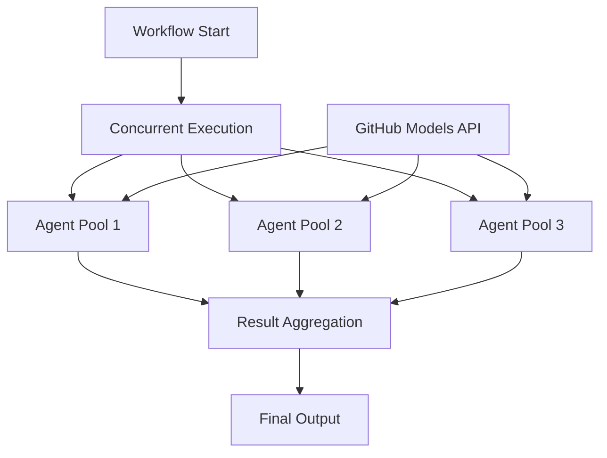

# Notebook: 03.python-agent-framework-workflow-ghmodel-concurrent

> Source: https://github.com/microsoft/ai-agents-for-beginners/blob/HEAD/08-multi-agent/code_samples/workflows-agent-framework/python/03.python-agent-framework-workflow-ghmodel-concurrent.ipynb

---

# ⚡ Concurrent Agent Workflows with GitHub Models (Python)

## 📋 Advanced Parallel Processing Tutorial

This notebook demonstrates **concurrent workflow patterns** using the Microsoft Agent Framework. You'll learn how to build high-performance, parallel processing workflows where multiple AI agents execute simultaneously, dramatically improving throughput and enabling sophisticated multi-threaded business processes.

## 🎯 Learning Objectives

### 🚀 **Concurrent Processing Fundamentals**
- **Parallel Agent Execution**: Run multiple agents simultaneously for maximum efficiency
- **Workflow Orchestration**: Coordinate concurrent operations while maintaining data consistency
- **Performance Optimization**: Achieve significant speedup through parallel processing
- **Resource Management**: Efficiently utilize AI model resources across concurrent operations

### 🏗️ **Advanced Concurrency Patterns**
- **Fork-Join Processing**: Split work across multiple agents and merge results
- **Pipeline Parallelism**: Overlapping execution stages for continuous throughput
- **Load Balancing**: Distribute work evenly across available agent resources
- **Synchronization Points**: Coordinate concurrent agents at critical workflow stages

### 🏢 **Enterprise Concurrent Applications**
- **High-Volume Document Processing**: Process multiple documents simultaneously
- **Real-Time Content Analysis**: Concurrent analysis of incoming data streams
- **Batch Processing Optimization**: Maximize throughput for large-scale operations
- **Multi-Modal Analysis**: Parallel processing of different content types (text, images, data)

## ⚙️ Prerequisites & Setup

### 📦 **Required Dependencies**

Install Agent Framework with concurrent workflow capabilities:

```bash
pip install agent-framework-core -U
```

### 🔑 **GitHub Models Configuration**

**Environment Setup (.env file):**
```env
GITHUB_TOKEN=your_github_personal_access_token
GITHUB_ENDPOINT=https://models.inference.ai.azure.com
GITHUB_MODEL_ID=gpt-4o-mini
```

**Concurrent Processing Considerations:**
- **Rate Limits**: Monitor GitHub Models API rate limits for concurrent requests
- **Resource Usage**: Consider memory and CPU usage with multiple concurrent agents
- **Error Handling**: Implement robust error recovery for parallel operations

### 🏗️ **Concurrent Workflow Architecture**



**Key Benefits:**
- **⚡ Performance**: Significant speedup through parallel execution
- **📈 Scalability**: Handle increased workloads without proportional time increase
- **🔄 Efficiency**: Better utilization of available computational resources
- **🎯 Throughput**: Process more work in the same amount of time

## 🎨 **Concurrent Workflow Design Patterns**

### 🔍 **Research & Analysis Pipeline**
```
Research Task → Parallel Research Agents → Content Synthesis → Quality Review
```

### 📊 **Data Processing Workflow**
```
Input Data → Concurrent Processing Agents → Result Aggregation → Final Report
```

### 🎭 **Content Creation Pipeline**
```
Content Brief → Parallel Content Generators → Review & Merge → Final Content
```

### 🔄 **Multi-Stage Processing**
```
Input → Stage 1 (Concurrent) → Stage 2 (Concurrent) → Stage 3 (Sequential) → Output
```

## 🏢 **Enterprise Performance Benefits**

### ⚡ **Throughput Optimization**
- **Parallel Execution**: Multiple agents working simultaneously
- **Resource Utilization**: Maximum efficiency of available AI model capacity
- **Time Reduction**: Significant decrease in total processing time
- **Scalable Architecture**: Easily add more concurrent agents as needed

### 🛡️ **Reliability & Resilience**
- **Fault Tolerance**: Individual agent failures don't stop the entire workflow
- **Error Isolation**: Problems in one concurrent branch don't affect others
- **Graceful Degradation**: System continues operating even with reduced agent capacity
- **Recovery Mechanisms**: Automatic retry and error handling for failed operations

### 📊 **Monitoring & Observability**
- **Concurrent Execution Tracking**: Monitor progress of all parallel operations
- **Performance Metrics**: Measure speedup and efficiency gains
- **Resource Usage Analytics**: Optimize concurrent agent allocation
- **Bottleneck Identification**: Find and resolve performance constraints

Let's build high-performance concurrent AI workflows! 🚀

```python
! pip install agent-framework-core -U
```

```python
import os
from typing import Any

from agent_framework import ChatMessage, ConcurrentBuilder,WorkflowViz
from agent_framework.openai import OpenAIChatClient
```

```python
chat_client = OpenAIChatClient(base_url=os.environ.get("GITHUB_ENDPOINT"), api_key=os.environ.get("GITHUB_TOKEN"), model_id="gpt-4o" )
```

```python
ResearcherAgentName = "Researcher-Agent"
ResearcherAgentInstructions = "You are my travel researcher, working with me to analyze the destination, list relevant attractions, and make detailed plans for each attraction."
```

```python
PlanAgentName = "Plan-Agent"
PlanAgentInstructions = "You are my travel planner, working with me to create a detailed travel plan based on the researcher's findings."
```

```python
research_agent   = chat_client.create_agent(
        instructions=(
           ResearcherAgentInstructions
        ),
        name=ResearcherAgentName,
    )

plan_agent = chat_client.create_agent(
        instructions=(
            PlanAgentInstructions
        ),
        name=PlanAgentName,
    )
```

```python
workflow = ConcurrentBuilder().participants([research_agent, plan_agent]).build()
```

```python
print("Generating workflow visualization...")
viz = WorkflowViz(workflow)
# Print out the mermaid string.
print("Mermaid string: \n=======")
print(viz.to_mermaid())
print("=======")
# Print out the DiGraph string.
print("DiGraph string: \n=======")
print(viz.to_digraph())
print("=======")
svg_file = viz.export(format="svg")
print(f"SVG file saved to: {svg_file}")
```

```python
from IPython.display import SVG, display, HTML
import os

print(f"Attempting to display SVG file at: {svg_file}")

if svg_file and os.path.exists(svg_file):
    try:
        # Preferred: direct SVG rendering
        display(SVG(filename=svg_file))
    except Exception as e:
        print(f"⚠️ Direct SVG render failed: {e}. Falling back to raw HTML.")
        try:
            with open(svg_file, "r", encoding="utf-8") as f:
                svg_text = f.read()
            display(HTML(svg_text))
        except Exception as inner:
            print(f"❌ Fallback HTML render also failed: {inner}")
else:
    print("❌ SVG file not found. Ensure viz.export(format='svg') ran successfully.")
```

```python
events = await workflow.run("Plan a trip to Seattle in December")
outputs = events.get_outputs()
```

```python
if outputs:
        print("===== Final Aggregated Conversation (messages) =====")
        for output in outputs:
            messages: list[ChatMessage] | Any = output
            for i, msg in enumerate(messages, start=1):
                name = msg.author_name if msg.author_name else "user"
                print(f"{'-' * 60}\n\n{i:02d} [{name}]:\n{msg.text}")
```